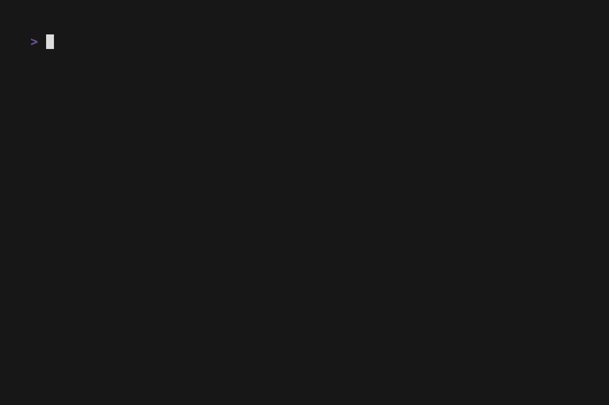

# trafilo

> Conccurnt streaming event-handler framework in C. Written from scratch:)



[](https://github.com/Basliel25/trafilo/actions)
[]()
[]()

---

> READ THE [DOCS](https://basliel25.github.io/trafilo/)
> READ [HOW I MADE IT - blog in the work)

## Synopsis

Trafilo is a conccurent single-machine streaming framework in C. It accepts streams of events (v0.1.0 only supports a UDP stream of raw events) , a parser, and a set of callbacks. It then orchastrates the rest including **dispatching events by key across a worker pool**, **maintaining per-key state**, **accumulating events into sliding windows**, and **calling a user defined sink when a window emits**. The framework owns the threading and synchronization while granting maximal freedom on domain logic to the user.

It exists because batch frameworks don't fit streaming workloads. Trafilo runs continuously and thus keeping per-key state alive across events and emitting aggregates on a cadence you control — the right shape for monitoring and anomaly detection. 

---

## Quick start

```sh
git clone https://github.com/Basliel25/trafilo
cd trafilo
make && sudo make install
```

---
```C
#include <trafilo.h>
#include <stdio.h>
#include <stdlib.h>
#include <string.h>
#include <time.h>

static int parse(const char *raw, size_t len, event_t **out) {
    const char *sp = memchr(raw, ' ', len);
    if (!sp) return -1;
    event_t *e = malloc(sizeof *e);
    e->key         = strndup(raw, sp - raw);
    e->payload     = NULL;
    e->payload_len = 0;
    clock_gettime(CLOCK_MONOTONIC, &e->t_secs);
    *out = e;
    return 0;
}

static void event_free(event_t *e)                          { free(e->key); free(e); }
static void handle(const event_t *e, void *state)           { (*(size_t *)state)++; (void)e; }
static void *state_init(const char *key)                    { (void)key; return calloc(1, sizeof(size_t)); }
static void state_free(void *s)                             { free(s); }
static void sink(const char *key, const window_result_t *r, void *s) {
    printf("%s  window=%zu  total=%zu\n", key, r->event_count, *(size_t *)s);
}

int main(void) {
    trafilo_config_t cfg = {
        .port              = 9999,
        .num_workers       = 4,
        .num_buckets       = 127,
        .window_size_ms    = 5000,
        .slide_interval_ms = 1000,
        .parse      = parse,
        .event_free = event_free,
        .handle     = handle,
        .sink       = sink,
        .state_init = state_init,
        .state_free = state_free,
    };
    trafilo_t *t = trafilo_create(&cfg);
    return trafilo_run(t);
}
```

```sh
gcc myapp.c $(pkg-config --cflags --libs trafilo) -o myapp
```

---

## Architecture

```
network → socket → queue → dispatcher → hashmap → window → sink
```
###### Execution flow
One listener thread reads UDP datagrams and pushes raw lines onto a bounded queue. When working queue is populated and the N worker threads are signaled, they pull from that queue concurrently, parse each line into an event, and dispatch by key into a hashmap sharded with per-bucket mutexes (limiting contention on threads only on shared keys). 
Each bucket owns a sliding window that tracks event timestamps over a configurable retention horizon. when the slide cadence elapses the worker calls the users' sink with a snapshot of the window and the bucket's accumulated state.

> Full details in (construction)

---

## API overview

### Configuration
```C
trafilo_config_t cfg = {
    /* network */
    .port              = 9999,      /* UDP port to bind */
    .recv_timeout_ms   = 100,       /* SO_RCVTIMEO; 0 = block forever */

    /* threading */
    .num_workers       = 4,         /* worker thread count */
    .num_buckets       = 127,       /* hashmap buckets — use a prime */

    /* sliding window */
    .window_size_ms    = 5000,      /* event retention horizon */
    .slide_interval_ms = 1000,      /* emit cadence */

    /* callbacks — you provide all of these */
    .parse      = my_parse,
    .event_free = my_event_free,
    .handle     = my_handle,
    .sink       = my_sink,          /* optional, NULL to disable */
    .state_init = my_state_init,    /* optional, NULL if stateless */
    .state_free = my_state_free,    /* optional, NULL if stateless */
};
```
For full configuration check out the full config guide on docs().
### Lifecycle

```c
trafilo_t *t = trafilo_create(&cfg);
trafilo_run(t);        /* blocks */
trafilo_shutdown(t);   /* from signal handler or another thread */
trafilo_destroy(t);
```

### Bypassing the socket

```c
trafilo_emit(t, raw, len);  /* push a raw line directly into the queue */
```

> Full API reference: [Doxy API Reference](https://basliel25.github.io/trafilo/api/index.html)

---

## Examples

- **[`examples/hiveparser.c`](examples/hiveparser.c)** — live ncurses dashboard
  of per-service event rate and error percentage, fed by the dummy daemon
  harness in `dummyDameon/`. Demonstrates all five user callbacks and how to
  layer a visualization thread on top of `trafilo_run`.

```sh
make examples
./build/examples/hiveparser &
cd dummyDameon && docker compose up
```

Press `q` to quit cleanly.

---

## Build and test

```sh
make           # static + shared + pkg-config
make test      # unit tests via Unity
make examples  # build demos (hiveparser requires ncurses)
make install   # PREFIX=/usr/local by default, honors DESTDIR
```

Dependencies: 
- gcc
- pthreads
- hiveparser example requires ncurses

---

## License

MIT
